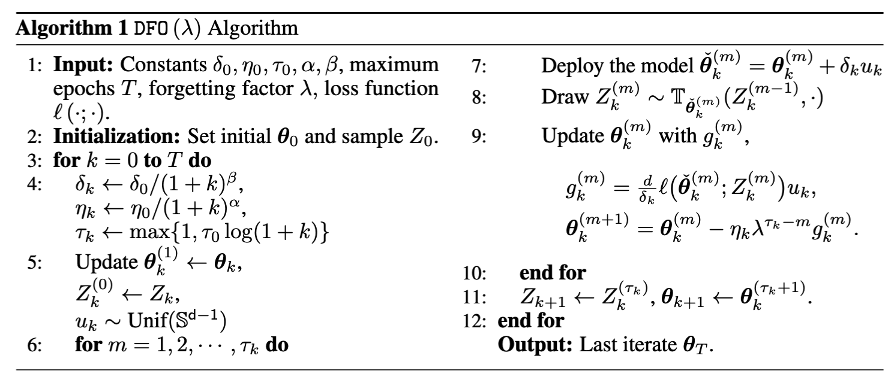
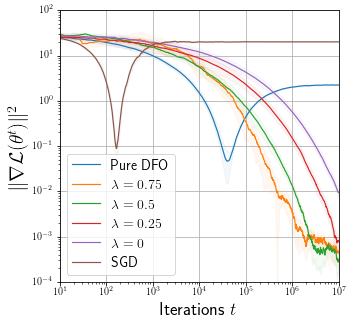

# **Higher Dimension Case: Markovian Pricing**

## 1. **Code Guidelines**

This implementation is based on mpi4py in python. 

## 2. **Introduction**
 - We consider an example of multi-dimensional pricing problem with $d=5$. Let $\boldsymbol{\theta} \in \mathbb{R}^5$ denote the prices of 5 goods and $\kappa$ be the drifting parameter. 
 - Our goal is to maximize the average revenue 
 $$
 \max_{\theta \in \mathbb{R}^d}\mathbb{E}_{Z \sim \Pi_{\boldsymbol{\theta}}}[\ell(\boldsymbol{\theta} ; Z)] , \quad 
 \ell(\boldsymbol{\theta} ; z)=-\langle\boldsymbol{\theta} \mid z\rangle
 $$
  - where $\Pi_{\boldsymbol{\theta}}=\mathcal{N}\left(\mu_0-\kappa \boldsymbol{\theta}, \sigma^2 I\right)$ is the unique stationary distribution of the following Markov process. 
  $$ 
  z_{t+1}=(1-\gamma) z_t+\gamma \mathcal{N}\left(\mu_0-\kappa \boldsymbol{\theta}, \frac{2-\gamma}{\gamma} \sigma^2 I\right)
  $$
  - Note that the performative optimal solution is $\boldsymbol{\theta}_{P O}=\arg \min _{\boldsymbol{\theta}} \mathcal{L}(\boldsymbol{\theta})=$ $\mu_0 /(2 \kappa)$.
  

## 3. **Algorithm Description ${\sf DFO(\lambda)}$**
<!--  -->

- Notations: $\lambda$ is forgetting factor, 代码中我们使用self.forgettingfactor表示这个量

<div align="center">

</div>


## 4. Simulation Detialed Settings
- We set $\gamma=0.5$, drifting parameter $\kappa=0.5$, initial mean of non-shifted distribution $\mu_0=[-2,2,-2,2,-2]^{\top}$. 
- The benchmarked algorithms are initialized by $\boldsymbol{\theta}_0=[2,-2,2,-2,2]^{\top}$.
- We simulate the convergence behavior for different algorithms in Figure. 

## 5. Observation

<div align="center">

</div>

- We observe that due to the increased problem dimension $d$, the differences between the DFO $(\lambda)$ algorithms with different $\lambda$ becomes more significant.


## 6. Folder structure 代码结构 
```
project-izzo
│   README.md
│   config.py 试验常用参数设置   
│   main.py 整个实验的代码执行入口
│   visual.ipynb 可视化试验结果
│
└───fig
│   │   algo.png # 算法伪代码
│   │   simulation_text # 试验参数设置
│   
└───res-new
│    │   保存所有数值试验的结果
│   
└───src
│   │Algo.py #class RGD, DFO, AlgoBase(算法基类)
│   │problem.py # definition of simulation problem
│   │
│   
└───Trash (some trash python code) 
```


